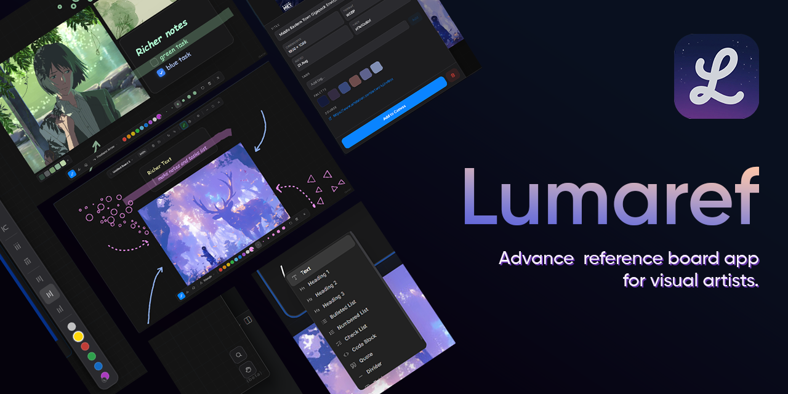

  

# Lumaref 🌙

**The ultimate offline reference board and workspace for visual artists.**

Lumaref is a powerful, lightweight, and completely offline desktop reference board designed to streamline the creative workflow for artists, illustrators, and designers. Gather references, organize your thoughts on an infinite canvas, and focus purely on your art without the clutter.

> **🚀 Beta Notice:** Lumaref is currently in active development (Beta). You can expect rapid updates, exciting new features, and continuous UI/UX polishing as the app evolves!

---

## ✨ Key Features

* **Infinite Canvas:** Freely pan, zoom, and arrange your reference images, notes, and mood boards on a limitless workspace.
* **Built-in Web Browser:** Search ArtStation, Pinterest, and Google Images directly inside the app with an integrated, ad-blocked browser.
* **One-Click Capture:** Instantly grab images from the built-in browser and drop them right onto your board.
* **Smart Asset Library:** Drag and drop local images, tag them, and instantly search your entire visual library.
* **Single File Save System:** Everything in your session—images, notes, and layouts—is saved into a single, portable `.lref` file.
* **Study & Annotation Tools:** Draw directly over references, auto-extract color palettes, toggle grayscale mode, and use the Always-On-Top feature while you paint or sculpt.
* **100% Offline & Private:** No accounts, no subscriptions, and no forced cloud syncing. Your boards belong to you.

---

## 📥 Download & Links

* **Download Lumaref:** [Get the latest release here](https://iamhemant.itch.io/lumaref)
* **Bloomeex:** [Visit bloomeex](https://bloomeex.org) 
* **Watch the Showreel:** [Lumaref Beta Showreel on YouTube](https://youtu.be/DmkjiF7ZDFc)

---

## 💬 Community & Support

Join the conversation! Share your feedback, report bugs, or request features in our active community.
* **Discord Server:** [Join the Lumaref Discord](https://discord.gg/2HgUux92e)

---
*Developed with ❤️ for artists by Hemant Kumar / Bloomeex.*